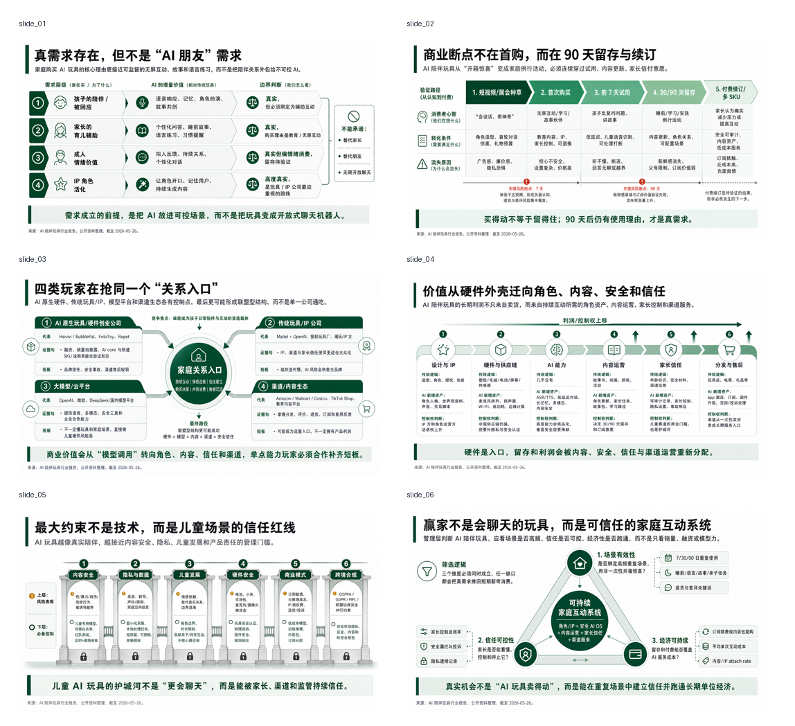
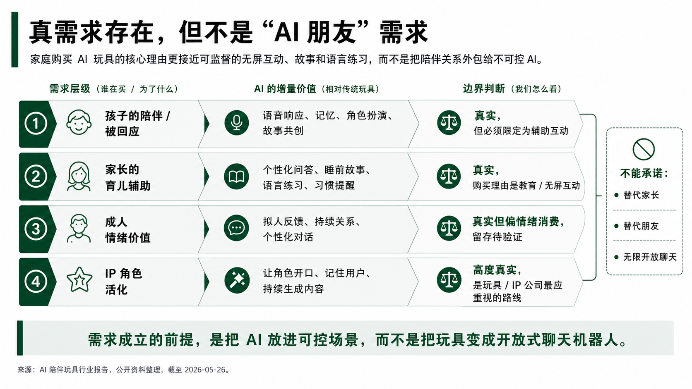
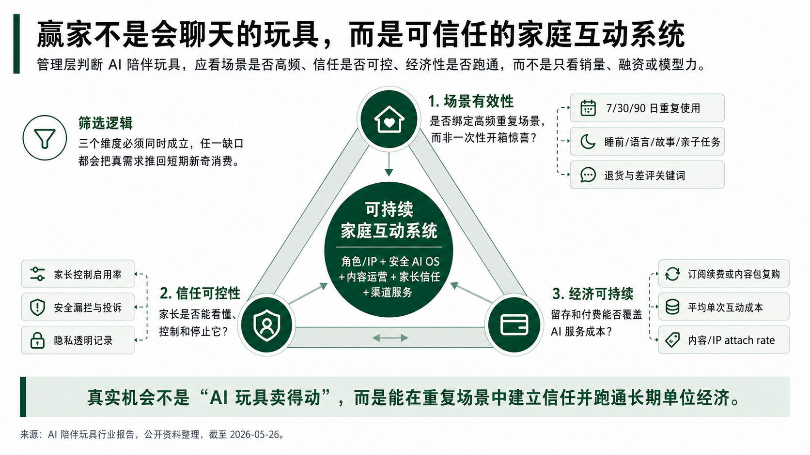
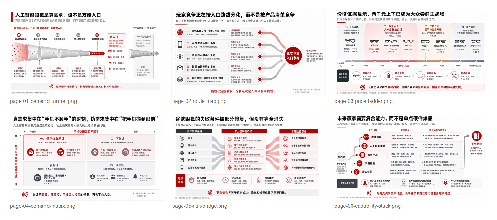
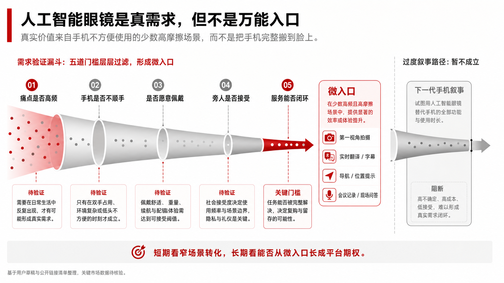
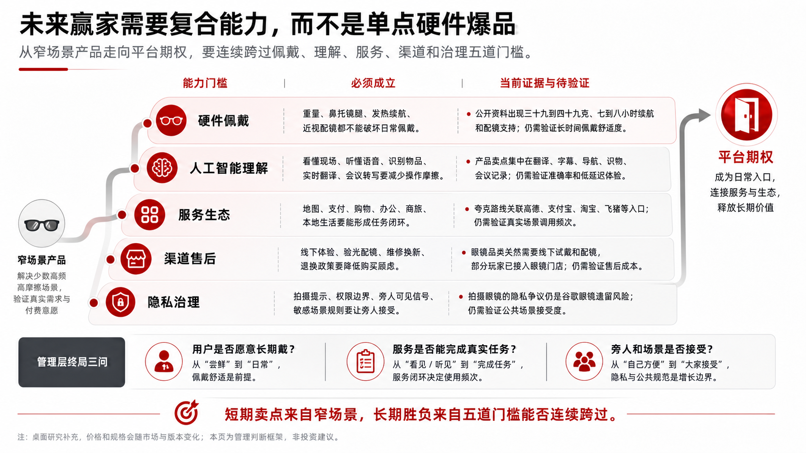

# RW Consulting PPT Skill

一个面向粗糙业务材料的 AI 咨询 PPT 工作流。

把行业报告、会议纪要、访谈笔记和半成品 bullet，转成 `proof-object-first` 的图片版咨询 PPT：先对齐目标，再梳理 `storyline`，再确认样页，最后交付 PNG + `image-only PPTX`。


> From rough business inputs to proof-object-first consulting slides.

## 它解决什么问题？

很多 PPT 难做，不是因为不会排版，而是因为输入材料本身还很粗糙：

- 多份行业报告读完了，但还没有 synthesis。
- 会议纪要很长，但没有变成一组清晰的汇报页。
- 研究判断有了，但不知道每页应该证明什么。
- 大纲里全是 bullet，但缺少管理层能读懂的 `storyline` 和证据结构。

RW Consulting PPT Skill 的重点不是“美化 PPT”，而是把粗糙材料先变成可交付的咨询表达：

```text
粗糙材料 -> 目标对齐 -> storyline -> 页面 brief -> 样页确认 -> PNG / image-only PPTX
```

## 30 秒开始

把这个目录放到你的 Codex skills 目录里：

```powershell
# Windows PowerShell
New-Item -ItemType Directory -Force "$env:USERPROFILE\.codex\skills" | Out-Null
Copy-Item -Recurse -Force .\rw-consulting-ppt-skill "$env:USERPROFILE\.codex\skills\rw-consulting-ppt"
```

```bash
# macOS / Linux
mkdir -p ~/.codex/skills
cp -R ./rw-consulting-ppt-skill ~/.codex/skills/rw-consulting-ppt
```

然后在 Codex 里这样触发：

```text
请使用 rw-consulting-ppt，把这些行业研究材料整理成 6 页中文管理层汇报。

目标受众：业务负责人
交付模式：独立阅读型报告页
信息密度：标准咨询密度
视觉风格：管理层报告风，白底，深绿作为强调色
输出格式：PNG + image-only PPTX
```

## 交流与答疑

如果你下载并使用这个 skill，欢迎扫码加入微信群一起讨论 AI x Consulting 工作流、PPT 生成效果和使用问题。二维码可能会过期，过期后可以通过 GitHub issue 提醒更新。


## 适合什么场景？

### 1. 行业报告分析 PPT

当你手里有多份行业报告、访谈纪要、公开资料和研究笔记，但还没有清晰的 deck 结构时，可以让这个 skill 先帮你完成 synthesis，再压缩成几页管理层可读的行业判断页。

它会把材料拆成：

- 核心问题：这套 deck 到底要回答什么？
- working thesis：目前最重要的判断是什么？
- storyline：页面之间如何递进？
- 页面级 claim：每页要证明哪一个结论？
- proof object：用什么结构承载证据，而不是堆 bullet？
- evidence boundary：哪些事实已支持，哪些还需要补证？

### 2. 会议 recap PPT

当你刚开完客户会议、老板 brainstorm 或项目 catch-up，只拿到一份长纪要 / 逐字稿时，可以让这个 skill 帮你整理成 recap deck。

它适合把会议材料转成：

- 本次讨论的核心议题；
- 已形成共识的判断；
- 仍然有分歧或需要确认的问题；
- 下一次讨论前需要补齐的证据；
- 面向管理层或客户的简洁 recap 页面。

## 效果示例

### 示例 1：AI 陪伴玩具行业判断

从行业研究材料生成 6 页管理层判断 deck，重点展示需求成立条件、留存逻辑、玩家格局、价值链迁移、信任风险和赢家逻辑。

- [AI 陪伴玩具 6 页总览图](examples/ai-companion-toys-management-deck/contact_sheet.png)







### 示例 2：AI 眼镜行业研究

从半成品行业判断生成 6 页咨询页，重点展示需求验证、入口路线分化、价格带、真实需求矩阵、Google Glass 风险桥和未来赢家能力栈。

- [AI 眼镜 6 页总览图](examples/ai-glasses-market-deck/contact_sheet.png)







## 它不是普通 PPT 模板

这个 skill 有意选择图片版咨询 PPT 路线。

它会做：

- 生成一张完整 16:9 PNG 作为一页 slide；
- 用 `proof object` 承载每页论证，比如漏斗、路径图、玩家格局、能力栈、风险桥；
- 先生成 1-2 页样页，让你确认风格、密度和表达逻辑；
- 在样页通过后，再批量生成完整 deck；
- 如果需要 PPTX，则把每张 PNG 打包成 `image-only PPTX`。

它不会做：

- editable PPTX 的文本框、图表、SmartArt 或形状；
- HTML / CSS / React 页面截图；
- Python / Pillow / SVG / canvas 绘制的伪 PPT；
- 普通模板套壳或三栏卡片堆叠。

如果你需要可编辑 PowerPoint，请使用别的 workflow。这个 skill 的定位是：先把复杂业务材料变成咨询级图片页。

## 工作流


### 1. Preference alignment

开始前先确认 6 件事：

- 受众 / 使用场景；
- live presentation 还是 standalone report deck；
- 页数或图片数；
- 信息密度：简洁、标准、密集；
- 视觉风格 / 主题色；
- 输出格式：PNG，或 PNG + `image-only PPTX`。

### 2. Inputs for PPT Production

把粗糙材料整理成一份生产输入包：

- Context
- Core Question
- Working Thesis
- Storyline
- Page-Level Inputs
- Open Questions

这一步的目标不是直接出图，而是先把要讲的事想清楚。

### 3. Deck Blueprint

为整套 deck 定义：

- 每页标题；
- 每页 governing message；
- 每页 proof object；
- 每页 visual mode；
- 需要补齐或标注的不确定证据。

这一版需要用户确认。没有 blueprint approval，不进入样页。

### 4. Sample brief

先为 1-2 页代表性页面写详细 brief：

- 页面角色；
- page claim；
- proof object；
- visual mother concept；
- must-keep text / number；
- bottom synthesis policy；
- source note / caveat 处理方式。

### 5. Sample gate

先生成样页，再判断是否可以批量。

如果样页看起来像普通 PPT 模板、信息太空、结论太多、证据和图形关系不清楚，应该先改 brief 或 prompt，而不是直接批量生成。

### 6. Batch generation and packaging

样页确认后，才批量生成剩余页面。最后可以用 `scripts/package_image_deck.py` 把 PNG 打包成 `image-only PPTX`。

## 输出物

一个标准输出通常包含：

```text
slides/
  slide_01.png
  slide_02.png
  ...
contact_sheet.png
deck-name-image-only.pptx
run_notes.md
```

PPTX 里的每一页只有一张完整图片，不包含可编辑文本对象。

## 质量护栏

### Alignment-first

没有确认目标、页数、信息密度、风格和输出格式之前，不开始生产。

### Storyline before design

先确认核心问题、working thesis 和页面逻辑，再写 slide brief。不要一上来就让模型“做几页好看的 PPT”。

### One slide, one claim

每页只有一个最高优先级结论。标题、subtitle、proof object、底部 takeaway 不能互相抢主结论。

### Proof-object-first

每页必须有一个能承载论证的视觉结构，而不是只有卡片、图标和 bullet。

常见 proof object：

- demand validation funnel
- retention funnel
- player landscape
- route map
- value-chain shift
- risk bridge
- capability stack
- decision matrix

### Density preservation

独立阅读型报告页不能为了“干净”而变成空海报。信息密度是管理层报告页的一部分：要减少阅读摩擦，但不能丢掉证据结构。

### Sample rejection

样页出现这些问题时，应拒绝并重写：

- 像普通可编辑 PPT 模板；
- 只有漂亮卡片，没有 proof object；
- 标题、数字、底部结论互相竞争；
- 文本太少，无法独立阅读；
- 全绿、全蓝、全灰等一色到底；
- 证据和结论的视觉连接不成立。

## 适合 / 不适合

适合：

- 行业分析、市场判断、玩家格局、机会评估；
- 客户会议、老板 brainstorm、项目 catch-up 的 recap deck；
- 需要从粗糙材料中提炼 `storyline` 的 PPT；
- 需要图片版咨询页，而不是可编辑 PPT 模板；
- 需要先看样页、再批量生成的工作流。

不适合：

- 必须逐字可编辑的 PowerPoint；
- 大量数据表格的精确排版；
- 企业模板规范非常严格的内部汇报；
- 只需要一页视觉海报，不需要咨询论证；
- 已经有完整 PPT，只想简单换皮美化。

## 示例 prompt

### 行业报告分析 PPT

```text
请使用 rw-consulting-ppt，把我上传的行业资料整理成 6 页中文管理层汇报。

目标受众：业务负责人和战略团队
核心问题：这个市场是真需求，还是短期热点？
交付模式：独立阅读型报告页
信息密度：标准咨询密度
视觉风格：管理层报告风，白底，深绿作为强调色，不要互联网模板感
输出格式：PNG + image-only PPTX

如果我没有给出页面大纲，请先帮我提出 storyline 和页面列表，等我确认后再进入样页 brief。
```

### 会议 recap PPT

```text
请使用 rw-consulting-ppt，把这份会议纪要整理成 5 页 recap deck。

目标受众：客户项目组和内部负责人
交付模式：独立阅读型报告页
信息密度：标准
视觉风格：克制、清晰、适合会后对齐
输出格式：PNG

请先梳理本次讨论的核心议题、已形成共识、仍需确认的问题和下一步需要补齐的证据。
不要直接生成图片，先给我 deck blueprint。
```

## 目录结构

```text
rw-consulting-ppt-skill/
  SKILL.md
  README.md
  agents/
  examples/
    ai-glasses-market-deck/
    ai-companion-toys-management-deck/
  references/
    concept-image-director.md
    consulting-image-context.md
    deck-consistency-lock.md
    example-lessons.md
    image-only-output-contract.md
    message-hierarchy-rules.md
    message-proof-mapping.md
    sample-rejection-rubric.md
    visual-style-master.md
  scripts/
    package_image_deck.py
```

## FAQ

### 为什么不是 editable PPTX？

因为这个 skill 的核心不是做可编辑组件，而是让 AI 生成完整的咨询页图像。可编辑 PPTX 更适合结构稳定、内容精确、模板明确的场景；这个 workflow 更适合把粗糙业务材料转成高质量视觉表达。

### 生成的 PPTX 还能修改吗？

可以作为整体图片页移动、替换、插入，但不能逐字编辑文本。如果要改内容，建议回到 slide brief 或 prompt 层重生成对应页面。

### 为什么一定要先确认样页？

图片生成一旦批量跑偏，返工成本很高。`sample gate` 用来先验证风格、信息密度、文本可读性和 proof object 是否成立。

### 可以只生成 PNG，不生成 PPTX 吗？

可以。PPTX 只是把已确认的 PNG 机械打包成演示文件。

### 可以用于英文 deck 吗？

可以，但默认示例和质量规则以中文管理层报告页为主。英文 deck 也应保留相同原则：alignment-first、storyline before design、proof-object-first。
