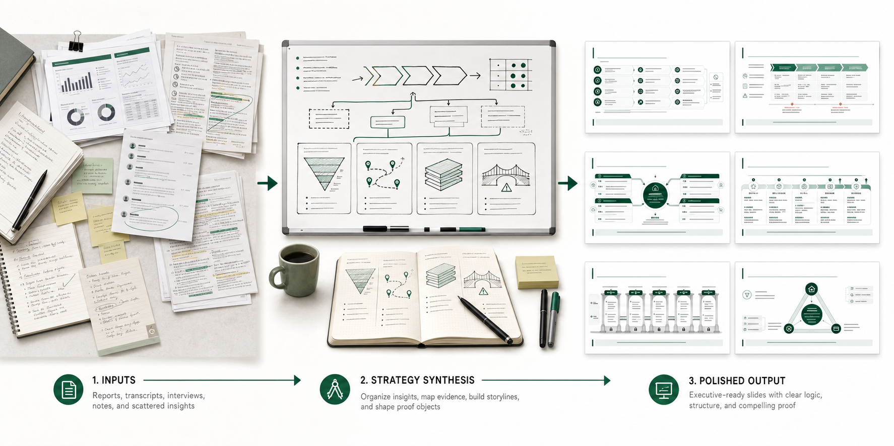
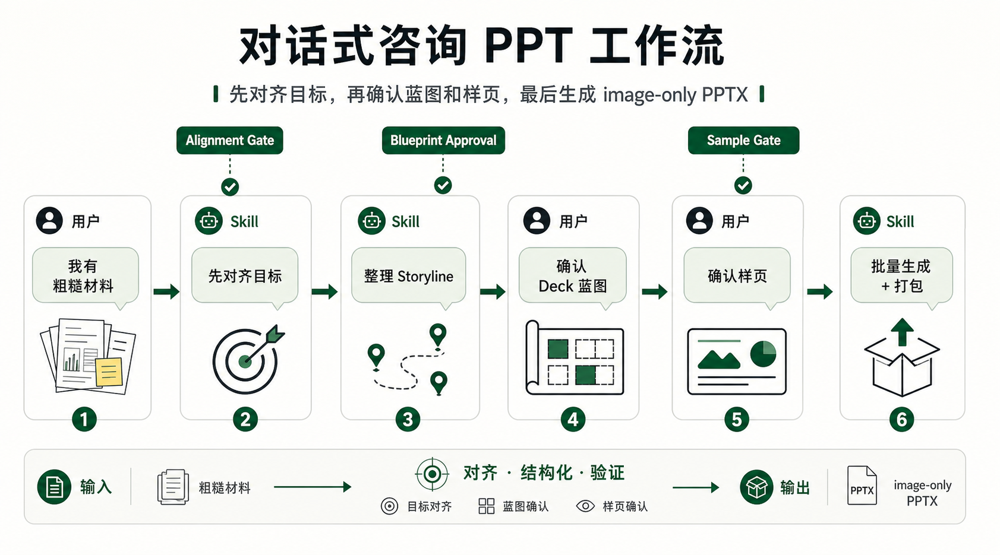
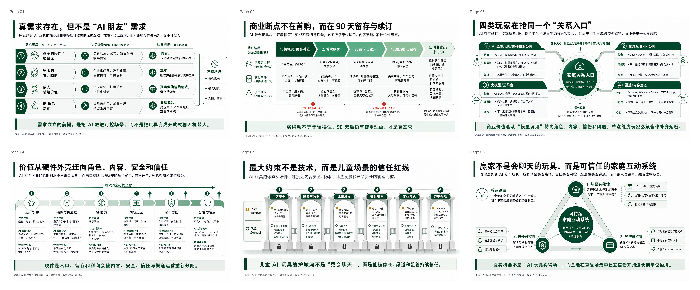
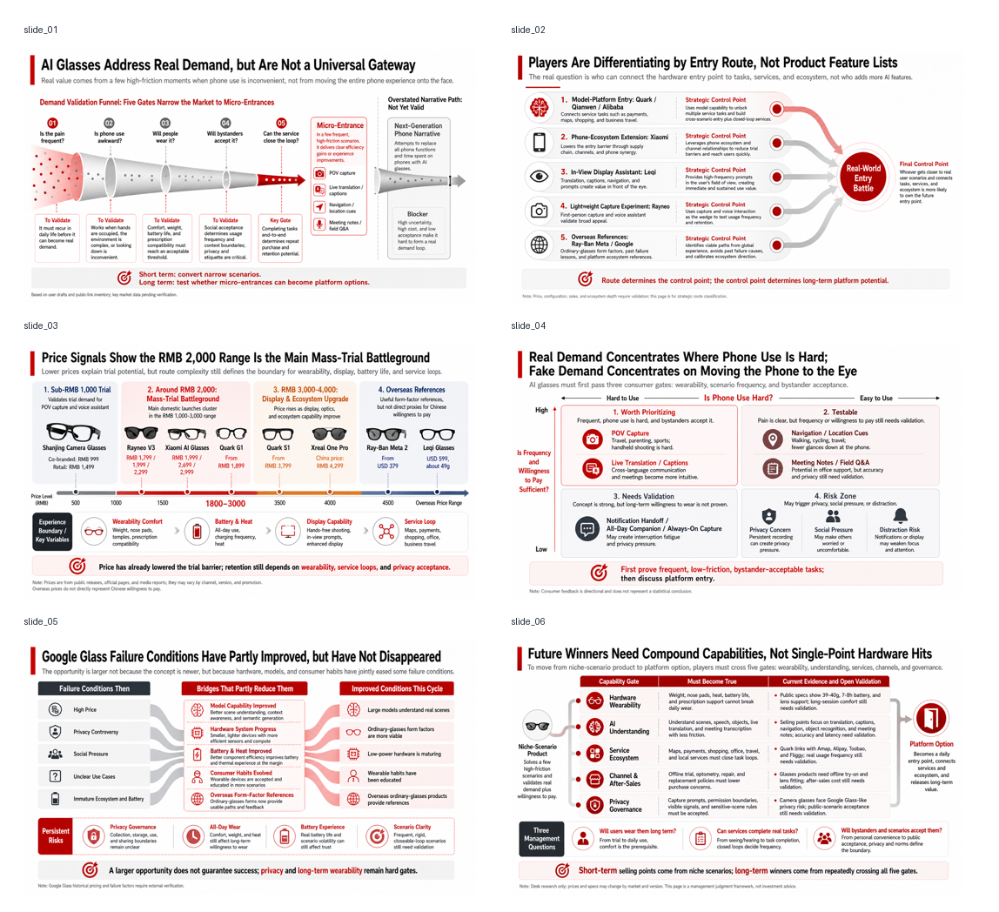

# RW Consulting PPT

An opinionated Codex skill package for turning rough business material into consulting-grade slide outputs, with clear editability tradeoffs.

This repository contains two sibling Codex skills:

- `rw-consulting-ppt` turns rough notes, research findings, meeting transcripts, and page outlines into proof-object-first consulting slides. It is image-first: full-slide PNGs, then optional image-only PPTX packaging.
- `ppt-to-editable` converts a single finished slide image into a single-slide editable PPTX where practical. It is a post-confirmation conversion layer: OCR, editable text recovery, simple native shapes/tables, tight source crops, and an editability report.

The two skills are intentionally separate. `rw-consulting-ppt` creates the consulting slide image; `ppt-to-editable` can later recover limited editability for selected pages. This package does not promise a fully native, all-object editable PowerPoint deck from rough notes in one step.

## Visual Preview



From rough business inputs to proof-object-first consulting slides.

## When To Use

Use `rw-consulting-ppt` when the hard part is the consulting expression:

- rough research needs a sharp storyline;
- meeting notes need to become a concise recap deck;
- a page needs one governing message and a visible proof object;
- the desired output is PNG or PNG plus image-only PPTX;
- sample approval and visual QA matter more than direct object-level editability.

Use `ppt-to-editable` when the input is already a finished slide image:

- one PNG, JPG, or screenshot should become one editable PPTX slide;
- the goal is to recover editable text and simple native objects where practical;
- complex visuals can remain as tight image crops;
- the output must include `editability_report.json` so users know what is editable and what is still image-based.

## Quick Start

Copy one or both skill folders into your Codex skills directory.

Windows PowerShell:

```powershell
$skillsDir = "$env:USERPROFILE\.codex\skills"
New-Item -ItemType Directory -Force "$skillsDir\rw-consulting-ppt" | Out-Null
New-Item -ItemType Directory -Force "$skillsDir\ppt-to-editable" | Out-Null
Copy-Item -Recurse -Force .\skills\rw-consulting-ppt\* "$skillsDir\rw-consulting-ppt\"
Copy-Item -Recurse -Force .\skills\ppt-to-editable\* "$skillsDir\ppt-to-editable\"
```

macOS / Linux:

```bash
mkdir -p ~/.codex/skills/rw-consulting-ppt ~/.codex/skills/ppt-to-editable
cp -R ./skills/rw-consulting-ppt/. ~/.codex/skills/rw-consulting-ppt/
cp -R ./skills/ppt-to-editable/. ~/.codex/skills/ppt-to-editable/
```

Example prompt for `rw-consulting-ppt`:

```text
Use rw-consulting-ppt to turn these market research notes into a 6-page executive consulting deck.

Audience: business owner and strategy team
Core question: is this market showing durable demand or only short-term hype?
Delivery mode: standalone report deck
Detail level: standard consulting density
Visual style: management-report style, white base, deep green accent, no generic SaaS template look
Output format: PNG first, then image-only PPTX after sample approval

If I have not provided a page outline, propose the storyline and page list first. Do not create slide briefs or image prompts until I approve the blueprint.
```

Example prompt for `ppt-to-editable`:

```text
Use ppt-to-editable to convert this single-slide PNG into a one-slide editable PPTX.

Input: one slide image
Goal: recover editable title, body text, labels, and main numbers where practical
Layout target: stay close to the source image; do not leave source text visible underneath editable text
Routing: run OCR and OCR review first; use clean-background editable text or source-image reconstruction based on the page structure; use a hybrid fallback only if explicitly accepted
Style constraint: do not add shadows, glow, bevel, reflection, soft edges, or PowerPoint theme effects unless they are present in the source
Deliverables: editable PPTX, preview image, and editability_report.json
```

## Workflow



`rw-consulting-ppt` uses a gated workflow:

1. Alignment gate: confirm audience, delivery mode, page count, density, visual style, evidence boundary, and output format.
2. Inputs for PPT production: organize rough material into context, core question, working thesis, storyline, page-level inputs, and open questions.
3. Blueprint approval: confirm the core question, working thesis, page list, and representative sample pages.
4. Sample brief approval: define the proof object, core visual concept, must-keep text, evidence boundary, and bottom-synthesis policy for 1-2 sample pages.
5. Sample generation: generate representative full-slide PNG samples and reject weak samples before batch production.
6. Batch generation and packaging: generate one PNG per slide, run consistency QA, and optionally package accepted PNGs into an image-only PPTX.

`ppt-to-editable` uses a conversion workflow:

1. Confirm the input is one slide image.
2. Run OCR and OCR review before reconstructing text.
3. Choose the route: clean-background editable text, source-image reconstruction, or an explicitly accepted hybrid fallback.
4. Rebuild editable text and simple native shapes/tables where practical.
5. Preserve complex visuals as tight source crops.
6. Produce a preview and `editability_report.json`.

## Output Contracts

`rw-consulting-ppt` default output:

```text
slides/
  slide_01.png
  slide_02.png
  ...
contact_sheet.png
deck-name-image-only.pptx
run_notes.md
```

The image-only PPTX contains one full-slide image per slide and no editable text objects.

`ppt-to-editable` default output:

```text
source/
  slide_01.png
ocr_results.json
ocr_overlay_debug.png
text_mask_debug.png
editability_report.json
deck-name-editable.pptx
preview.png
```

Actual editability is limited to what the report verifies: editable text boxes, native shapes, native tables, and source image crops. Complex visuals usually remain images.

## Quality Gates

Both skills are designed to stop early when the output would be misleading.

For `rw-consulting-ppt`:

- Do not start production before alignment is confirmed.
- Do not create slide briefs before blueprint approval.
- Do not batch-generate before sample brief and sample approval.
- Reject samples that look like generic editable PPT templates, thin card grids, decorative dashboards, or pages without a governing proof object.
- Keep one highest-priority conclusion per slide.
- Preserve enough density for standalone report decks; clean but empty concept posters are failures.

For `ppt-to-editable`:

- Do not describe a slide as reconstructed unless native text, shapes, tables, or source crops are actually present.
- Do not hide source text under editable text.
- Do not use a full-slide background to fake editability.
- Do not promise full-native reconstruction for arbitrary images.
- Use `editability_report.json` as the delivery truth.

## Examples

The examples include one Chinese reference deck and one English localized deck:

- One original Chinese example is retained as a source-quality reference.
- One full English example deck has been generated from a Chinese source deck by changing only the slide text, preserving the visual system, information density, composition, and page rhythm.

### Chinese Reference Example

The Chinese example is retained so users can inspect the original output density, visual rhythm, and consulting-report page structure.

**AI Companion Toys Management Deck**



### English Localized Example

The English example was generated from the AI glasses market deck by changing only the readable slide text while preserving the visual system, information density, composition, and page rhythm.

<p>
  
</p>

Start with `skills/rw-consulting-ppt/examples/README.md` for the current example inventory and the Image2 text-conversion prompt.

## Community

For discussion and feedback, the primary community channel is the WeChat group below. GitHub issues are also welcome for bug reports, QR refresh requests, and repository-level questions.

<p>
  
</p>

## License & Attribution

MIT License © 2026 RW Consulting PPT contributors.

If you build on, fork, adapt, or cite this repository, attribution is appreciated. Please mention this repository as the source to help support ongoing maintenance.

欢迎在二次开发或引用时注明本仓库来源，感谢支持项目持续维护。

## Repository Structure

```text
rw-consulting-ppt/
  README.md
  LICENSE
  docs/
    english-publication-style-guide.md
    release-checklist.md
  skills/
    rw-consulting-ppt/
      SKILL.md
      agents/
      assets/
      examples/
        README.md
      references/
      scripts/
    ppt-to-editable/
      SKILL.md
      agents/
      references/
      scripts/
```

## Not A Fit

This package is not a fit when you need:

- a fully native editable PowerPoint deck generated directly from rough notes;
- exact reconstruction of every chart, gradient, icon, photo, and line as editable PowerPoint objects;
- strict corporate-template compliance;
- large spreadsheet-style tables with exact layout guarantees;
- a generic "make this PPT prettier" template workflow.

## FAQ

### Why is `rw-consulting-ppt` image-first?

Because its job is consulting expression: storyline, proof object, information hierarchy, and visual authority. Full-slide images preserve the generated exhibit as a coherent page. When small text edits are needed later, selected pages can be sent to `ppt-to-editable`.

### Can the generated PPTX be edited?

The default `rw-consulting-ppt` PPTX is image-only. You can move, replace, insert, or delete whole slide images, but you cannot edit individual text objects inside those images.

`ppt-to-editable` can recover limited editability for a single slide image. Text boxes, simple shapes, and simple tables may become editable; complex visuals remain image crops. Check `editability_report.json` before claiming editability.

### Can I generate only PNG files?

Yes. PPTX packaging is optional. The image-only PPTX is a mechanical wrapper around accepted PNGs.

### Can this be used for English decks?

Yes. The workflow supports English decks. Use English prompts, English evidence labels, and English typography defaults. CJK-specific OCR, fonts, and line-wrap rules should only be used for CJK source slides.
