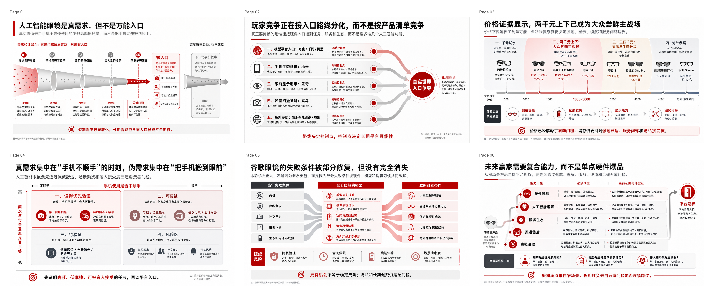

# RW Consulting PPT Skills

这个仓库包含两个互相独立的 Codex Skills：

- `rw-consulting-ppt`：把行业报告、会议纪要、访谈笔记和半成品 bullet，转成 `proof-object-first` 的图片版咨询 PPT。
- `astralow-for-editable-ppt`：把单张 slide 图片、PNG、截图，或图片型 PPT 的页面 转换成更可编辑的 PowerPoint。

两者平级放在 `skills/` 目录下，需要分别安装、分别触发，互不覆盖。`rw-consulting-ppt` 默认交付 PNG + `image-only PPTX`；如果需要后续编辑，可以再用 `astralow-for-editable-ppt` 逐页转换；多页结果另行合并并检查。


> From rough business inputs to proof-object-first consulting slides.

## 效果展示

下面是两个 6 页 deck 的高清 3×2 overview。点击图片可以打开原图查看细节。

### 示例 1：AI 陪伴玩具行业判断

从行业研究材料生成 6 页管理层判断 deck，重点展示需求成立条件、留存逻辑、玩家格局、价值链迁移、信任风险和赢家逻辑。

<p>
  <a href="skills/rw-consulting-ppt/examples/ai-companion-toys-management-deck/overview-3x2.png"></a>
</p>

### 示例 2：AI 眼镜行业研究

从半成品行业判断生成 6 页咨询页，重点展示需求验证、入口路线分化、价格带、真实需求矩阵、Google Glass 风险桥和未来赢家能力栈。

<p>
  <a href="skills/rw-consulting-ppt/examples/ai-glasses-market-deck/overview-3x2.png"></a>
</p>

## 它解决什么问题？

很多 PPT 难做，不是因为不会排版，而是因为输入材料本身还很粗糙：

- 多份行业报告读完了，但还没有 synthesis。
- 会议纪要很长，但没有变成一组清晰的汇报页。
- 研究判断有了，但不知道每页应该证明什么。
- 大纲里全是 bullet，但缺少管理层能读懂的 `storyline` 和证据结构。

RW Consulting PPT Skill 的重点不是“美化 PPT”，而是把粗糙材料先变成可交付的咨询表达：

```text
粗糙材料 -> 目标对齐 -> storyline -> 页面 brief -> 样页确认 -> PNG / image-only PPTX -> 可选关键页 editable conversion
```

## 30 秒开始

把需要的 skill 目录放到你的 Codex skills 目录里。两个 skill 是平级目录，需要分别安装，互不覆盖。

```powershell
# Windows PowerShell
New-Item -ItemType Directory -Force "$env:USERPROFILE\.codex\skills" | Out-Null
New-Item -ItemType Directory -Force "$env:USERPROFILE\.codex\skills\rw-consulting-ppt" | Out-Null
New-Item -ItemType Directory -Force "$env:USERPROFILE\.codex\skills\astralow-for-editable-ppt" | Out-Null
Copy-Item -Recurse -Force .\skills\rw-consulting-ppt\* "$env:USERPROFILE\.codex\skills\rw-consulting-ppt"
Copy-Item -Recurse -Force .\skills\astralow-for-editable-ppt\* "$env:USERPROFILE\.codex\skills\astralow-for-editable-ppt"
```

```bash
# macOS / Linux
mkdir -p ~/.codex/skills/rw-consulting-ppt ~/.codex/skills/astralow-for-editable-ppt
cp -R ./skills/rw-consulting-ppt/. ~/.codex/skills/rw-consulting-ppt/
cp -R ./skills/astralow-for-editable-ppt/. ~/.codex/skills/astralow-for-editable-ppt/
```

## 运行依赖

新版转换 Skill 需要 Python 3.10+、python-pptx 和 Pillow。在仓库根目录运行：

```sh
python -m pip install -r skills/astralow-for-editable-ppt/requirements.txt
```

只复制了 Skill 文件夹时，请使用安装目录内的 requirements.txt。实际渲染与编辑验证需要 Windows 桌面 PowerPoint；其他环境可构建 PPTX，但不能标为 Office 验证通过。模型需由用户选择 Astra low，Skill 不会自动切换模型。

## 旧版用户升级

将下面这段指令复制给 Codex：

```text
请将我已安装的 ppt-to-editable 升级为新版 astralow-for-editable-ppt。
从 https://github.com/Pikapika260214/rw-consulting-ppt 的 skills/astralow-for-editable-ppt 目录安装。
先将旧 ppt-to-editable 备份到 Skill 搜索目录之外，再安装新版及缺失依赖。
如果已安装新版，请更新，避免重复安装。保留历史 PPT 和输出文件，不要覆盖 rw-consulting-ppt。
完成后检查新版名称、文件和依赖是否可用。
```

升级后使用 `$astralow-for-editable-ppt` 调用；若当前会话未识别新版，请新开任务。更多信息见 [升级说明](UPGRADE.md)。

然后在 Codex 里这样触发：

生成图片版咨询 deck：

```text
请使用 rw-consulting-ppt，把这些行业研究材料整理成 6 页中文管理层汇报。

目标受众：业务负责人
交付模式：独立阅读型报告页
信息密度：标准咨询密度
视觉风格：管理层报告风，白底，深绿作为强调色
输出格式：PNG + image-only PPTX
```

转换单页图片为可编辑 PPTX：

```text
使用 $astralow-for-editable-ppt 将这张图转成可编辑 PPT。
保留原文、布局和视觉关系，输出 PPTX 与实际渲染预览，说明哪些局部仍是图片。
```

## 适合什么场景？

### 1. 行业报告分析 PPT

当你手里有多份行业报告、访谈纪要、公开资料和研究笔记，但还没有清晰的 deck 结构时，可以让这个 skill 先帮你完成 synthesis，再压缩成几页管理层可读的行业判断页。

它会把材料拆成：

- 核心问题：这套 deck 到底要回答什么？
- working thesis：目前最重要的判断是什么？
- storyline：页面之间如何递进？
- 页面级 claim：每页要证明哪一个结论？
- proof object：用什么结构承载证据，而不是堆 bullet？
- evidence boundary：哪些事实已支持，哪些还需要补证？

### 2. 会议 recap PPT

当你刚开完客户会议、老板 brainstorm 或项目 catch-up，只拿到一份长纪要 / 逐字稿时，可以让这个 skill 帮你整理成 recap deck。

它适合把会议材料转成：

- 本次讨论的核心议题；
- 已形成共识的判断；
- 仍然有分歧或需要确认的问题；
- 下一次讨论前需要补齐的证据；
- 面向管理层或客户的简洁 recap 页面。

## 它不是普通 PPT 模板

这个 skill 有意选择图片版咨询 PPT 路线。

它会做：

- 生成一张完整 16:9 PNG 作为一页 slide；
- 用 `proof object` 承载每页论证，比如漏斗、路径图、玩家格局、能力栈、风险桥；
- 先生成 1-2 页样页，让你确认风格、密度和表达逻辑；
- 在样页通过后，再批量生成完整 deck；
- 如果需要 PPTX，则把每张 PNG 打包成 `image-only PPTX`；
- 如果少数关键页面需要后续编辑，可再用 `astralow-for-editable-ppt` 逐页转换成单页 editable PPTX。

`rw-consulting-ppt` 本身不会直接做：

- 从粗糙材料一步生成整套全页、全对象原生可编辑 PPTX；
- 用 HTML / CSS / React 截图伪装成 PPT 页面；
- Python / Pillow / SVG / canvas 绘制的伪 PPT；
- 普通模板套壳或三栏卡片堆叠。

如果你已经有成品 slide 图片或 image-only PPTX，并希望恢复部分编辑能力，可以使用同仓库的 `astralow-for-editable-ppt`。两个 skill 的分工是：`rw-consulting-ppt` 先把复杂业务材料变成咨询级图片页；`astralow-for-editable-ppt` 再逐页恢复编辑能力，多页另行合并。

## 新版更新：更轻量的图片转可编辑 PPT

新版针对 Astra low 简化了转换流程，提供绘图、渲染和检查工具。在一次单页测试中，转换从旧方案的十几分钟缩短到约 3 分钟，用时约为原来的五分之一；相比 Astra low 裸跑，耗时和按 Standard 费率估算的 credits 都减少约 10%。

[查看新版 Skill](skills/astralow-for-editable-ppt/SKILL.md) · [下载仓库 ZIP](https://github.com/Pikapika260214/rw-consulting-ppt/archive/refs/heads/main.zip)

文字、数字和主要结构尽量原生可编辑，复杂视觉可保留局部裁图。基础工具逐页处理，没有旧版多页 controller；多页需另行合并并检查。

## 工作流


### 1. Preference alignment

开始前先确认 6 件事：

- 受众 / 使用场景；
- live presentation 还是 standalone report deck；
- 页数或图片数；
- 信息密度：简洁、标准、密集；
- 视觉风格 / 主题色；
- 输出格式：PNG、PNG + `image-only PPTX`，或是否需要少数关键页 editable conversion。

### 2. Inputs for PPT Production

把粗糙材料整理成一份生产输入包：

- Context
- Core Question
- Working Thesis
- Storyline
- Page-Level Inputs
- Open Questions

这一步的目标不是直接出图，而是先把要讲的事想清楚。

### 3. Deck Blueprint

为整套 deck 定义：

- 每页标题；
- 每页 governing message；
- 每页 proof object；
- 每页 visual mode；
- 需要补齐或标注的不确定证据。

这一版需要用户确认。没有 blueprint approval，不进入样页。

### 4. Sample brief

先为 1-2 页代表性页面写详细 brief：

- 页面角色；
- page claim；
- proof object；
- visual mother concept；
- must-keep text / number；
- bottom synthesis policy；
- source note / caveat 处理方式。

### 5. Sample gate

先生成样页，再判断是否可以批量。

如果样页看起来像普通 PPT 模板、信息太空、结论太多、证据和图形关系不清楚，应该先改 brief 或 prompt，而不是直接批量生成。

### 6. Batch generation and packaging

样页确认后，才批量生成剩余页面。最后可以用 `skills/rw-consulting-ppt/scripts/package_image_deck.py` 把 PNG 打包成 `image-only PPTX`。

### 7. Selective editable conversion

如果某些页面需要改字、改数字或标签，可将最终 PNG 交给 `astralow-for-editable-ppt` 逐页转换。多页结果需另行合并并检查。

## 输出物

默认图片版输出通常包含：

```text
slides/
  slide_01.png
  slide_02.png
  ...
contact_sheet.png
deck-name-image-only.pptx
run_notes.md
```

默认的 `deck-name-image-only.pptx` 里，每一页只有一张完整图片，不包含可编辑文本对象。

如果启用了关键页可编辑化，每页还会交付 editable PPTX、实际渲染预览和简短报告。实际可编辑范围以最终文件及局部图片说明为准。

## 质量护栏

### Alignment-first

没有确认目标、页数、信息密度、风格和输出格式之前，不开始生产。

### Storyline before design

先确认核心问题、working thesis 和页面逻辑，再写 slide brief。不要一上来就让模型“做几页好看的 PPT”。

### One slide, one claim

每页只有一个最高优先级结论。标题、subtitle、proof object、底部 takeaway 不能互相抢主结论。

### Proof-object-first

每页必须有一个能承载论证的视觉结构，而不是只有卡片、图标和 bullet。

常见 proof object：

- demand validation funnel
- retention funnel
- player landscape
- route map
- value-chain shift
- risk bridge
- capability stack
- decision matrix

### Density preservation

独立阅读型报告页不能为了“干净”而变成空海报。信息密度是管理层报告页的一部分：要减少阅读摩擦，但不能丢掉证据结构。

### Sample rejection

样页出现这些问题时，应拒绝并重写：

- 像普通可编辑 PPT 模板；
- 只有漂亮卡片，没有 proof object；
- 标题、数字、底部结论互相竞争；
- 文本太少，无法独立阅读；
- 全绿、全蓝、全灰等一色到底；
- 证据和结论的视觉连接不成立。

## 适合 / 不适合

适合：

- 行业分析、市场判断、玩家格局、机会评估；
- 客户会议、老板 brainstorm、项目 catch-up 的 recap deck；
- 需要从粗糙材料中提炼 `storyline` 的 PPT；
- 需要高质量图片版咨询页，并可选对少数关键页做后续可编辑化；
- 需要先看样页、再批量生成的工作流。

不适合：

- 需要整套 deck 全页、全对象原生可编辑，且不接受图片页或逐页转换；
- 大量数据表格的精确排版；
- 企业模板规范非常严格的内部汇报；
- 只需要一页视觉海报，不需要咨询论证；
- 已经有完整 PPT，只想简单换皮美化。

## 示例 prompt

### 图片版咨询 deck

### 行业报告分析 PPT

```text
请使用 rw-consulting-ppt，把我上传的行业资料整理成 6 页中文管理层汇报。

目标受众：业务负责人和战略团队
核心问题：这个市场是真需求，还是短期热点？
交付模式：独立阅读型报告页
信息密度：标准咨询密度
视觉风格：管理层报告风，白底，深绿作为强调色，不要互联网模板感
输出格式：PNG + image-only PPTX

如果我没有给出页面大纲，请先帮我提出 storyline 和页面列表，等我确认后再进入样页 brief。
```

### 会议 recap PPT

```text
请使用 rw-consulting-ppt，把这份会议纪要整理成 5 页 recap deck。

目标受众：客户项目组和内部负责人
交付模式：独立阅读型报告页
信息密度：标准
视觉风格：克制、清晰、适合会后对齐
输出格式：PNG

请先梳理本次讨论的核心议题、已形成共识、仍需确认的问题和下一步需要补齐的证据。
不要直接生成图片，先给我 deck blueprint。
```

### 图片转可编辑 PPT

```text
使用 $astralow-for-editable-ppt 将这张完整页面图片转成可编辑 PPT。
保留文字、布局和视觉关系，主要文字、数字与结构使用原生对象。
输出 PPTX 和实际渲染预览，并说明哪些元素仍是局部图片。
```

## 目录结构

```text
rw-consulting-ppt/
  README.md
  LICENSE
  skills/
    rw-consulting-ppt/
      SKILL.md
      agents/
      assets/
      examples/
      references/
      scripts/
    astralow-for-editable-ppt/
      SKILL.md
      agents/
      references/
      scripts/
      requirements.txt
```

## FAQ

### 为什么默认不是 editable PPTX？

`rw-consulting-ppt` 先生成完整咨询页图像，默认 PPTX 的每页是一张图片。需要后续编辑时，再用 `astralow-for-editable-ppt` 转换选中的页面。

### 生成的 PPTX 还能修改吗？

图片版 PPTX 可整体移动或替换页面图片。转换后，原生文本框、形状等可以编辑，局部裁图内部仍不可逐对象编辑。需要大幅修改内容时，建议回到 brief 或 prompt 重新生成。

### 为什么一定要先确认样页？

图片生成一旦批量跑偏，返工成本很高。`sample gate` 用来先验证风格、信息密度、文本可读性和 proof object 是否成立。

### 可以只生成 PNG，不生成 PPTX 吗？

可以。默认图片版 PPTX 只是把已确认的 PNG 机械打包成演示文件；如果不需要演示文件，可以只交付 PNG。关键页 editable conversion 是额外步骤，只在你明确需要时再做。

### 可以用于英文 deck 吗？

可以，但默认示例和质量规则以中文管理层报告页为主。英文 deck 也应保留相同原则：alignment-first、storyline before design、proof-object-first。

## 交流与答疑

如果你下载并使用这个 skill，欢迎扫码加入微信群一起讨论 AI x Consulting 工作流、PPT 生成效果和使用问题。二维码可能会过期，过期后可以通过 GitHub issue 提醒更新。

<p>
  
</p>

## 联系作者

如有企业级 PPT 视觉设计、AI 战略咨询或其他相关合作需求，欢迎通过小红书联系作者。

<p>
  
</p>
